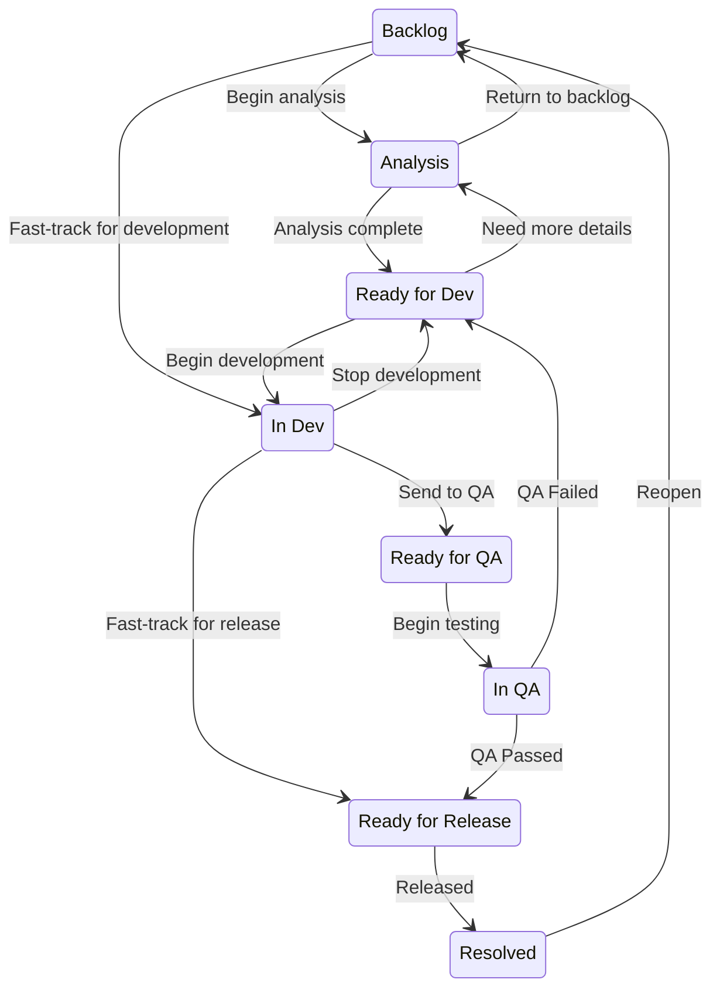
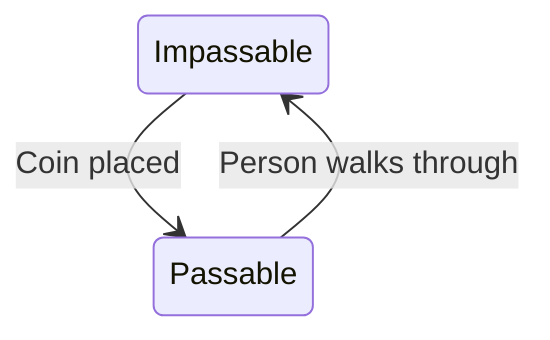

# 🚦 State Engine / Machine (PHP)

[](https://github.com/uuf6429/state-engine-php/actions/workflows/ci.yml)
[](https://codecov.io/gh/uuf6429/state-engine-php)
[](https://php.net/)
[](https://packagist.org/packages/uuf6429/state-engine)
[](https://packagist.org/packages/uuf6429/state-engine)
[](https://packagist.org/packages/uuf6429/state-engine)

This library provides some interfaces and a basic implementation of a State Engine or State Machine.

✨ **Highlights:**

- Dual functionality:
    1. Either as a basic state engine; switching to a desired state as long the transition is
       defined ([see "JiraIssueTest"](#jiraissuetest-state-engine))
    2. Or a more sophisticated state machine; same as above but matching data for any
       state ([see "TurnstileTest"](#turnstiletest-state-machine))
- Highly composable - everything can be replaced as desired
- [PSR-14](http://www.php-fig.org/psr/psr-14/) (Event Dispatcher) compatible
- Fluent builder interface ([see "From Scratch"](#from-scratch))
- Generates Mermaid or PlantUML markup ([see "Examples & Testing"](#-examples--testing))

## 🔌 Installation

The recommended and easiest way to install this library is through [Composer](https://getcomposer.org/):

```shell
composer require "uuf6429/state-engine-php"
```

## 🧐 Why?

In principle such an engine is easy to implement, but in practice it is typically implemented badly or forgotten.

For instance, one might have an `is_active` field thinking there will not be other states and then later on an
`is_pending` field is needed, at which point refactoring flags to state is too late.

In any case, this library abstracts away that situation or at least decreases the amount of code.

## 🤔 How?

There are a few key parts to how this works:

- **State** - an object representing a single state of a model. So models may have different state levels, for example a
  door can have _open_ and _closed_ states, but it can also be _locked_ and _unlocked_. In such a case, either consider
  the door lock as a separate model (with a separate engine instance) or merge all the states: _open_, _closed-unlocked_
  and _closed-locked_.
- **Transition** - an object representing a transition from one state to another. This is how you define the various
  state flows that your model can go through.
- **TransitionRepository** - an object that is aware of and provides all possible allowed transitions.
- **Engine** - an object that performs the transition of a model from one state to another. Usually you would have an
  engine instance for each stateful model in your application.

## 🚀 Usage

You have the possibility to use it from scratch or plug it into your existing. There are basically three parts to it:

1. configuring the engine (creating states and transitions)
2. using the engine (eg, in a web controller or service)
3. (optionally) handling events (with the same event dispatcher provided to the engine)

A slightly different situation would be when you need to provide a list of valid transitions, for example to the user.
In this case, having the [
`StateTraversion`](https://github.com/uuf6429/state-engine-php/blob/main/src/Implementation/Traits/StateTraversion.php)
trait on the repository would be useful.

### From Scratch

Here's a quick & dirty example with the provided implementation (that assumes that there is a "door" model):

```php
use App\Models\Door;  // example model that implements StateAwareInterface

use uuf6429\StateEngine\Implementation\Builder;
use uuf6429\StateEngine\Implementation\Entities\State;

$doorStateManager = Builder::create()
    ->defState('open', 'Open')
    ->defState('closed', 'Closed')
    ->defState('locked', 'Locked')
    ->defTransition('open', 'closed', 'Close the door')
    ->defTransition('closed', 'locked', 'Lock the door')
    ->defTransition('locked', 'closed', 'Unlock the door')
    ->defTransition('closed', 'open', 'Open the door')
    ->getEngine(); // you can pass an event dispatcher to the engine here

// find Door 123 (laravel-style repository-model)
$door = Door::find(123);

// close the door :)
$doorStateManager->changeState($door, new State('closed'));
```

### From Scratch (Custom)

You don't like how the Engine works? Or you feel that State could have more details?
Then you're in luck! With the whole library based on interfaces, you can easily replace parts of the implementation.
For example, you could store states or transitions in a database, in which case you can have your own
`TransitionRepository` that accesses the database.

### Existing Code

The library provides some flexibility so that you can connect your existing code with it. In more complicated scenarios,
you may have to build a small layer to bridge the gap. The example below illustrates how one can handle models with
flags instead of a single state.

```php
use App\Models\Door;  // example model

use uuf6429\StateEngine\Implementation\Builder;
use uuf6429\StateEngine\Implementation\Entities\State;

$door = Door::find(123);

$doorStateMutator = Builder::makeStateMutator(
    // define how we get the state
    static function () use ($door): State {
        if ($door->is_locked) {
            return new State('locked');
        }

        return $door->is_open
            ? new State('open')
            : new State('closed');
    },
    // define how we set the state
    static function (State $newState) use ($door): void {
        $door->update([
            'is_locked' => $newState->getName() === 'locked',
            'is_open' => $newState->getName() === 'open',
        ]);
    }
);

// assumes engine $doorStateManager was already defined
$doorStateManager->changeState($doorStateMutator, new State('closed'));
```

## 😎 Examples & Testing

You can find some examples in this readme as well
as [the tests](https://github.com/uuf6429/state-engine-php/tree/main/tests), some of which are explained below.

### [`JiraIssueTest`](https://github.com/uuf6429/state-engine-php/blob/main/tests/JiraIssueTest.php) State Engine

This test provides a realistic example of how Jira Issue states could be set up.

The test also generates the Mermaid diagram below, thanks to
the [Mermaidable trait](https://github.com/uuf6429/state-engine-php/blob/main/src/Implementation/Traits/Mermaidable.php):



### [`TurnstileTest`](https://github.com/uuf6429/state-engine-php/blob/main/tests/JiraIssueTest.php) State Machine

This test illustrates how a [state machine](https://en.wikipedia.org/wiki/Finite-state_machine) can be used to model
a [turnstile gate](https://en.wikipedia.org/wiki/Turnstile).
As before, here's the generated diagram:



Here's how the state machine definition looks like and how it could be used:

```php
use App\Models\Turnstile;  // example model that implements StateAwareInterface

use uuf6429\StateEngine\Implementation\Builder;

$turnstileStateMachine = Builder::create()
    // make states
    ->defState('locked', 'Impassable')
    ->defState('open', 'Passable')
    // make transitions
    ->defDataTransition('locked', ['insert_coin'], 'open', 'Coin placed')
    ->defDataTransition('open', ['walk_through'], 'locked', 'Person walks through')
    ->getMachine();

$turnstile = Turnstile::find(123);

// put coin in turnstile (notice that the final state is not mentioned)
$turnstileStateMachine->processInput($turnstile, ['insert_coin']);

// now $turnstile will be in "open" state
```
